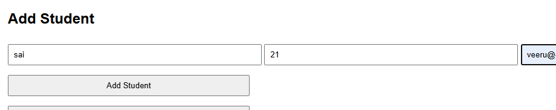
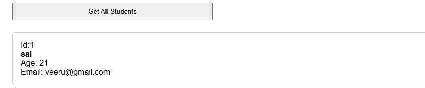
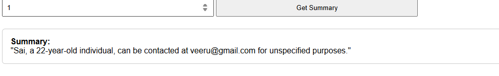

# FealtyX-Assignment

A simple and lightweight FastAPI-based REST API to manage student records and generate AI-powered summaries using Ollama and LLaMA models.

---

## 🚀 Features

- Add, view, update, and delete student details
- Generate student summaries using a local LLM (like LLaMA via Ollama)
- Thread-safe data operations with an in-memory store
- Input validation using Pydantic

---

## 🛠️ Requirements

Install dependencies:

```bash
pip install -r requirements.txt
```

---

## ▶️ How to Run

Start the FastAPI server:

```bash
uvicorn main:app --reload
```

> Make sure your Python file is named `main.py` or adjust accordingly.

---

## 📡 API Endpoints

| Method | Endpoint                     | Description                        |
|--------|------------------------------|------------------------------------|
| POST   | `/students`                  | Create a new student               |
| GET    | `/students`                  | Get all students                   |
| GET    | `/students/{id}`             | Get a student by ID                |
| PUT    | `/students/{id}`             | Update a student by ID             |
| DELETE | `/students/{id}`             | Delete a student by ID             |
| GET    | `/students/{id}/summary`     | Get AI-generated summary for student |

---

## 🧠 AI Summary (Ollama Integration)

To use the `/students/{id}/summary` endpoint, you must have [Ollama](https://ollama.com/) installed and running locally.

Start the LLaMA model with:

```bash
ollama run llama3.2
```

Then access:

```bash
http://localhost:11434/api/generate
```

The app sends a prompt to generate a one-sentence summary of the student based on their name, age, and email.

---
## 📷 Sample Results

### POST `/students`


### GET `/students`


### GET `/students/{id}`
.png)

### PUT `/students/{id}`


### GET `/students/{id}/summary`


## 📄 requirements.txt

```txt
fastapi
uvicorn
pydantic
requests
```

---

## 📬 License

This project is open-source and free to use.
